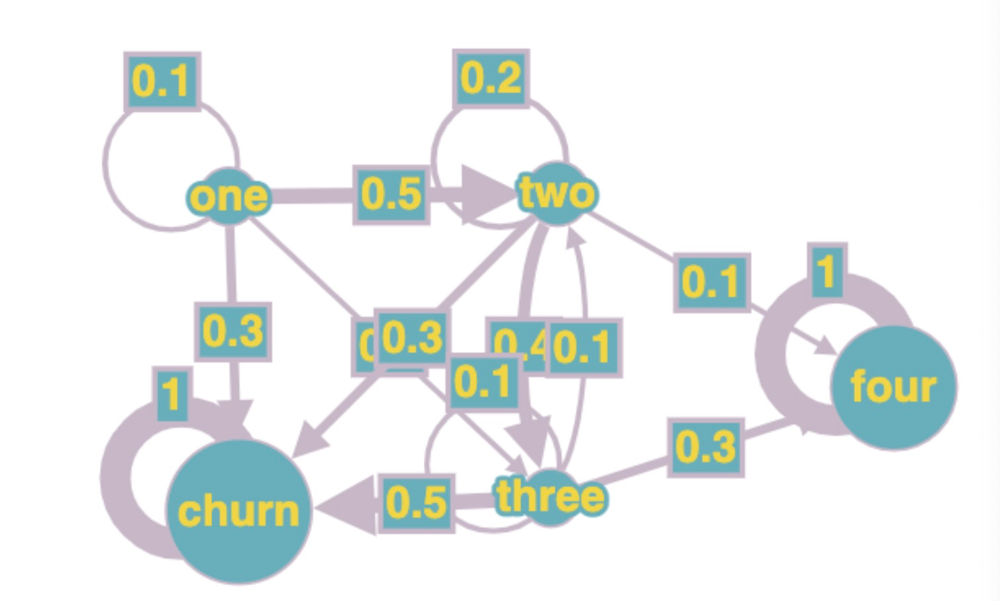

## Intro
`generate_sample_data_markov` takes a state transition matrix and label of states, simulate the full life cycle of N users
and generate simulated data.

Sample data for one user:
```plaintext
UID,action,date
0,one,2022-05-05
0,two,2022-05-06
0,three,2022-05-07
0,four,2022-05-08
```

`generate_all_paths` takes a state transition matrix and find all possible paths from one state to another. 

`main.py` runs the multi-path funnel e2e. It traverses through all possible paths and runs a funnel analysis for each path.
Result is shown below:

```
{'one': '100.0 %', 'two': '55.507 %', 'three': '27.691 %', 'four': '9.959 %'}
{'one': '100.0 %', 'two': '55.507 %', 'four': '6.994 %'}
{'one': '100.0 %', 'three': '10.985 %', 'two': '1.222 %', 'four': '0.4 %'}
{'one': '100.0 %', 'three': '10.985 %', 'four': '3.65 %'}
```
